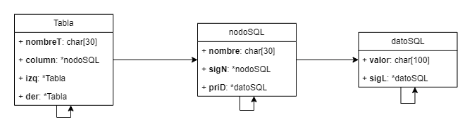
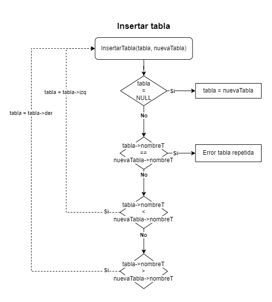
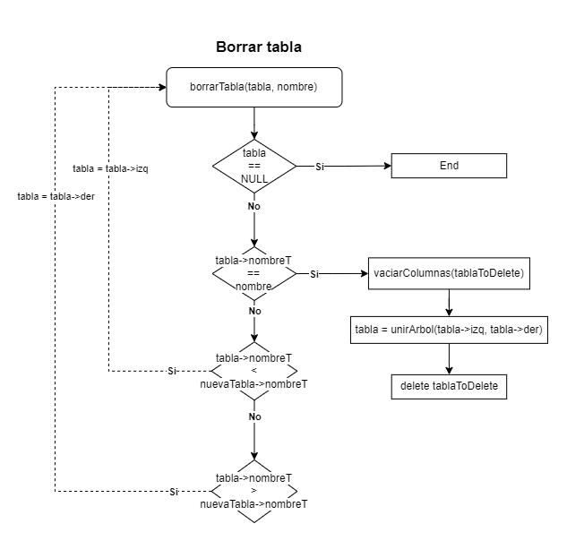
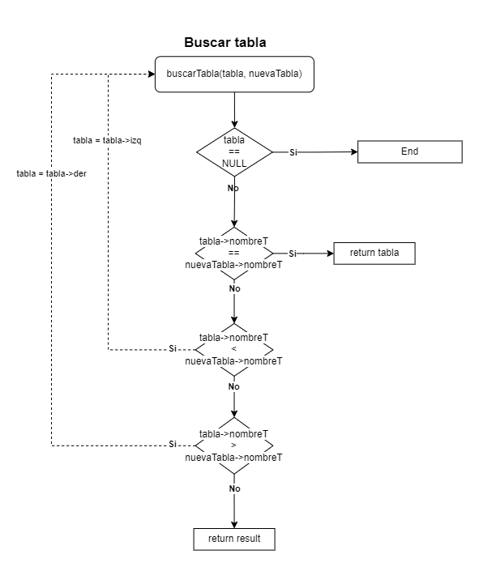
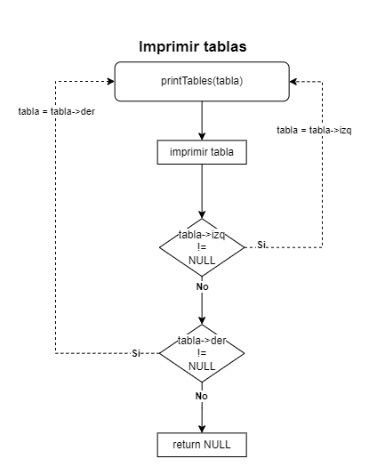

# DataBase

Proyecto en c++ de un gestor de base de datos MySQL.

## Indice

- [DataBase](#database)
  - [Indice](#indice)
  - [Diagramas de funciones](#diagramas-de-funciones)
    - [Insertar tabla](#insertar-tabla)
    - [Eliminar tabla](#eliminar-tabla)
    - [Buscar tabla](#buscar-tabla)
    - [Imprimir tabla](#imprimir-tabla)

Usando un sistema de árbol en el que cada tabla tiene un enlace a la izquierda y a la derecha de las demás tablas.

## Diagramas de funciones

### Insertar tabla

La función `insertarTabla` funciona de forma recursiva para insertar una nueva tabla, al principio de cada iteración se comprueba si el puntero raíz es igual a `NULL`, si lo es, la nueva tabla se asigna a esa posición, en caso contrario, se comprueba si el nombre de la nueva tabla ya está registrada y se vuelve a llamar a la función pasando la referencia a la izquierda o derecha dependiendo si el nombre es mayor o menor que la tabla 'padre'.

### Eliminar tabla

La función `borrarTable` funciona de forma recursiva para borrar la tabla seleccionada, al principio de cada iteración se comprueba si el puntero a la listas de tablas apunta a un valor `NULL`, en ese caso finaliza la iteración, de lo contrario comprobará si el nombre de la tabla actual es igual a la que se quiere eliminar, si lo es vaciará sus columnas volverá a unir el árbol y eliminará la tabla, en caso que no sea la tabla que se quiere eliminar se vuelve a llamar la función pasando como referencia la izquierda o derecha dependiendo si el nombre es mayor o menor que la tabla 'padre'.

### Buscar tabla

La función `buscarTabla` funciona de forma recursiva para buscar la tabla seleccionada, en un principio de cada iteración se comprueba si el puntero a la tabla apunta a un valor `NULL`, en ese caso finaliza la iteración, de lo contrario comprobará si el nombre de la tabla actual es igual a la buscada y la retornará, en caso contrario se vuelve a llamar la función pasando como referencia la izquierda o derecha dependiendo si el nombre es mayor o menor que la tabla 'padre'.

### Imprimir tabla

La función `imprimirTabla` funciona de forma recursiva para imprimir todas las tablas, en un principio imprime en pantalla la tabla raíz, luego vuelve a llamar a la función pasando la referencia a la izquierda o derecha dependiendo si la referencia a la izquierda o derecha es diferente de `NULL`.

